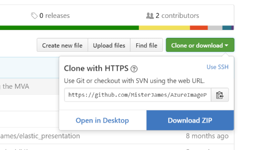
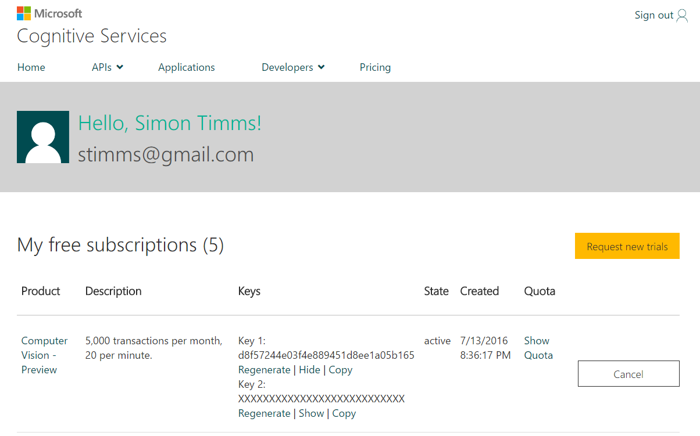

# Thanks for Your Interest

## Things Change!
When we recorded an MVA last fall we were excited to share with the community all the very cool things that you could weave together in Azure, and, yes there were many moving parts 
to the application we built. In fact, that was part of the point; the MVA was called "Putting 
all the Pieces Together" ([found here](https://mva.microsoft.com/en-us/training-courses/applications-on-azure-putting-all-the-pieces-together-14429?l=oQMSTsv0B_8004819052)).
s
However, over the last several months there have been a lot of changes to the Azure landscape 
and the services that are required to make ImageNomNom work, which is why you're likely finding
yourself here. 

## Keeping Current
So, in light of these changes, we ask you to consider this as the post-recording addendum. At 
the time of the recording, many parts were bleeding edge (like Project Oxford), in flux (like 
Web Apps) or just plain in development (like the DNS parts).

One of the things we did in the course was to  naiively say, "just go to our website, 
imagenomnom.com" as part of the lesson. Unfortunately this would require us trying to keep 
updated content on all the pieces after we recorded those videos, which was a lesson learned 
on our side. We do apologize for the confusion it has caused for our viewers and hope that you 
were still able to get something out of the course in spite of our short-sightedness.

This post will walk you through the things you need to know about to get yourself on track, 
without requiring imagenomnom.com to be running.

In summary, you're going to need to:
 - Download the source code from our repository on GitHub
 - Get an API key for Project Oxford and configure the keys in your copy of the project
 - Create a web app in Azure
 - Add a custom domain and configure DNS
 - Publish your code to Azure via Visual Studio

## Downloading the Source Code
The website was created and shared on GitHub. You can get the code by clicking on the 
download as zip from the repository landing page.

There are three pieces of source code that you'll want to familiarize yourself with, namely:
 - *AzureApplicationDemo*: the source to the web site - your own version of imagenomnom.com
 - *BatchTask*: web job application used to process images
 - *HostQueueProcessor*: sample C# API code for managing DNS entries programmatically

## Registering for "Project Oxford"
Project Oxford has been renamed Microsoft Cognitive Services, which you'll need to visit 
to create an account. Your dashboard should look something like this:

Take note of the key here, as you'll need it in the snext section of this update.

*As a precautionary note, don't share your key! Take care that you do not check it into your 
source repository (especially if it's public).*

 - [Cognitive Services Home page](https://www.microsoft.com/cognitive-services)
 - [How to identifiy faces in images](https://www.microsoft.com/cognitive-services/en-us/face-api/documentation/face-api-how-to-topics/howtoidentifyfacesinimage) 
 - [Set up a subscription](https://www.microsoft.com/cognitive-services/en-us/subscriptions (free trial))s

## Configure the Web Application
Running locally, the web application will use localDb, but you'll need to create a connection 
string from the Azure portal for a DB that you create/provision in the cloud.

For the `AzureApplicationDemo` project you're going to need to setup the connection strings for
Azure Storage in the "appSettings" section of your web.config, which is by default set to use the local, development storage. This will work fine on your local machine if you've installed the Azure SDK, but not when you deploy to the cloud. 

 - [Configuring a Database in the Azure Portal](https://azure.microsoft.com/en-us/documentation/articles/web-sites-dotnet-deploy-aspnet-mvc-app-membership-oauth-sql-database/)
 - [Configure web application settings](https://azure.microsoft.com/en-us/documentation/articles/web-sites-configure/) 

## Configuring the Domain
The beautiful thing about Azure is that you can get everything in place that you need from the 
portal. This includes creating a web app and registering your domain. In today's Azure, this 
process actually even creates the DNS entries you need, whereas at the time of recording, we 
only had the option of using PowerShell scripts (which, by the way, changed the day before 
we recorded!).

 - [Adding a Custom Domain to your Web Application](https://azure.microsoft.com/en-us/documentation/articles/custom-dns-web-site-buydomains-web-app/)

Optionally, you can configure DNS manually through the portal, or use PowerShell to create a solution to be used in scripts, though we generally recommend the method above:
 - [Create a DNS zone in the Azure portal](https://azure.microsoft.com/en-us/documentation/articles/dns-getstarted-create-dnszone-portal/)
 - [Create a DNS zone using powershell](https://azure.microsoft.com/en-us/documentation/articles/dns-getstarted-create-dnszone/)

## Configure The Batch Application
The solution contains a "BatchTask" project that does the image processing via the Cognitive 
Services API. You will need to use your key from the previous step to get the batch processing 
running correctly. You will find this setting in app.config in the root of the project.

For more information on batch processing, here are some handy links:
 - [Getting started](https://azure.microsoft.com/en-us/services/batch/)
 -[General documentation](https://azure.microsoft.com/en-us/documentation/services/batch/)

## Create Your OWN Web Application
Web Sites are now under the category of "Azure App Services", and you've already got one you can use if you bought a domain as suggested above. Here's some more information on websites running in Azure today: 

 - [Creating a Web Site in Azure App Services](https://azure.microsoft.com/en-us/documentation/articles/web-sites-dotnet-get-started/)
 - [Use Azure Blob Storage from ASP.NET](https://azure.microsoft.com/en-us/documentation/articles/storage-dotnet-how-to-use-blobs/)
 - [Using web jobs](https://azure.microsoft.com/en-us/documentation/articles/app-service-webjobs-readme/)

## Publishing Your Application
Finally, the process of publishing the application is now extremely straightforward, something 
that's been improving with each revision to the Azure portal and with Visual Studio.
 - [Deploy an ASP.NET web app to Azure App Service, using Visual Studio](https://azure.microsoft.com/en-us/documentation/articles/web-sites-dotnet-get-started/)

## Thanks Again!
We truly hope that you were successful in learning more about how these pieces fit together and how to get your application running in Windows Azure. 
